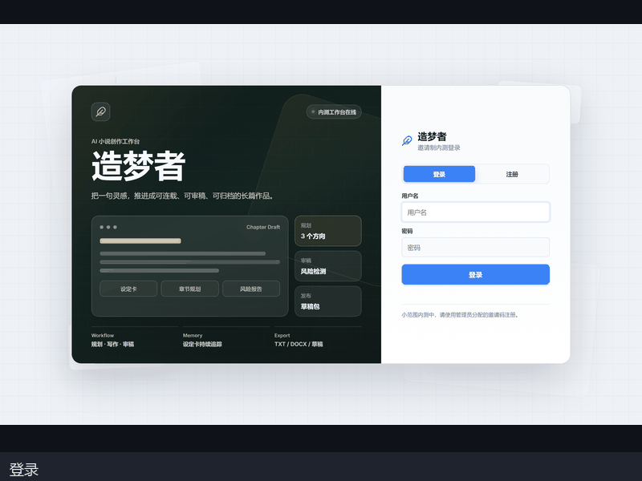

# 🌙 Dream Weaver (造梦者) | AI Long-Form Web Novel Platform

[](https://www.python.org/)
[](LICENSE)
[](https://fastapi.tiangolo.com/)
[](#)
[](#-try-it-without-an-llm)

> **An AI co-pilot built for long-form web novel authors.** From a one-line idea to 100+ chapters of consistent serialized fiction. Handles worldbuilding, character continuity, feedback-driven revision, and version rollback — so AI-written chapters don't drift off-rails after chapter 30.



[中文文档 (Chinese)](README.zh-CN.md) · [User Manual](USER_MANUAL.md) · [Writing Checklist](WRITING_CHECKLIST.md)

---

## ✨ What it does

### 🎯 End-to-end workflow

```
Idea → 3 directions → Detailed concept → Full chapter blueprint → Chapter 1 → Auto-continue → Reader feedback → Revision → ...
       ↓                  ↓                     ↓                       ↓                ↓
   Pick one          100 chapter            100 chapter            Auto-write         Apply
                    constraints list      targets + pacing       with constraints   feedback
                    + characters/factions + upgrade arc
```

### 🛠️ Core capabilities

| Capability | Description |
|---|---|
| **🧠 Multi-Agent** | `planner` / `writer` / `editor` / `patcher` / `reviewer` — each with its own prompt template, model role, and validation logic |
| **📚 Layered memory (MCP)** | Separate `mcp_server.py` + SQLite, structured storage for lore / characters / foreshadowing / chapter versions |
| **🔍 Cross-chapter retrieval** | When writing each chapter, auto-fetch relevant lore/settings/previous chapters to avoid drift |
| **✂️ Intelligent patching** | Localized risk fixes + full-chapter feedback revision + one-click rollback to any historical version |
| **🎭 Dynamic skills** | Built-in combat / emotion / dialogue specialist skills, dispatched based on chapter type |
| **💡 Long-form companion tools** | Chapter type detection / blueprint coverage / anti-AI-flavor check / character consistency / foreshadowing tracker |
| **📊 Real-time dashboard** | Word count / token cost / character usage / time / type distribution / consistency scan — all live |
| **⏪ Version rollback** | Every save/revision auto-saves a version; restore any past version with one click |
| **🌐 Dual provider** | Local GPUStack (Qwen3.5) + cloud MiniMax M3 (512K context for long chapters) |
| **🧪 Mock mode** | Try the entire UI with preset data — **no LLM key required** |

### 🎨 Writing pipeline

1. **Pitch**: AI generates 3 distinct story directions from a one-line seed
2. **Concept**: Pick one → specify chapter count (e.g. 100) → AI generates a 100-entry constraint list (purpose, core event, required characters, ending hook) + character/faction/world-rule cards
3. **Blueprint**: Auto-splits the constraint list into a 100-chapter roadmap with 5-act pacing
4. **Chapter 1**: AI writes the full chapter (2,000-3,000 chars) using blueprint + character state + previous context
5. **Continue**: Chapter 2/3/... each auto-writes using its own constraint + cross-chapter memory retrieval
6. **Feedback revision**: Reader gives feedback → AI applies targeted edits (preserves good parts)
7. **Auto-patch**: Detected risks → AI replaces minimal text fragments
8. **Long-form review**: At chapter 30/50/100 → run type distribution / consistency / anti-AI-flavor scan

---

## 🚀 Quick start

### Try it without an LLM (Mock mode — recommended for first-time visitors)

```bash
git clone https://github.com/<your-org>/dream-weaver.git
cd dream-weaver
pip install -r requirements.txt
cp .env.example .env

# Enable mock mode (no API key needed)
echo "MOCK_MODE=1" >> .env

# Start (two processes)
python mcp_server.py    # port 8001
python app.py          # port 8050
```

Open [http://localhost:8050](http://localhost:8050) → register an account → click **创作** → enter a seed → experience the full flow with preset mock data.

Mock mode answers every LLM call with realistic Chinese web-novel prose (see `mock_data.py`). You can:
- Walk through the entire UI (brainstorm → concept refinement → init → chapter generation → reflection → version rollback)
- Read preset chapters and see the dashboard, version history, and feedback flow
- All **without configuring an API key or burning any tokens**

### Real mode (with your own LLM)

1. **Get an API key** (pick one):
   - **Local GPUStack** (free, recommended): [gpustack/gpustack](https://github.com/gpustack/gpustack) + Qwen3.5-9B/27B models
   - **Cloud MiniMax M3** (best for long chapters): [MiniMax Open Platform](https://api.minimaxi.com) — get an API key
   - Any other OpenAI-compatible endpoint

2. **Configure** `.env`:
   ```ini
   MOCK_MODE=0
   API_KEY=your_local_gpustack_key
   BASE_URL=http://localhost:8000/v1
   MINIMAX_API_KEY=your_minimax_key
   MINIMAX_BASE_URL=https://api.minimaxi.com/v1
   ```

3. **Start**:
   ```bash
   python mcp_server.py    # port 8001 (data layer)
   python app.py          # port 8050 (API + frontend)
   ```

4. **First-time use**:
   1. Register an account (first user becomes admin)
   2. Click **创作** tab → write a one-line seed → AI generates 3 directions
   3. Pick one → fill in chapter count (e.g. 100) → AI generates full chapter constraints
   4. Click **启航创世** (Launch) → AI writes Chapter 1 (~2 min)
   5. Click **生成下一章** (Generate next) → auto-writes Chapter 2/3/...

> See [WRITING_CHECKLIST.md](WRITING_CHECKLIST.md) for common pitfalls and best practices.

---

## 🏗️ Architecture

```
dream-weaver/
├── app.py              # 🌐 FastAPI main service (port 8050)
├── mcp_server.py       # 💾 MCP data service (port 8001)
├── memory.py           # 📚 StoryBible wrapper (characters, lore, foreshadowing)
├── graph.py            # 🔀 LangGraph workflow (recall → plan → write → review)
├── models.py           # 🤖 Multi-provider LLM call (local + cloud)
├── mock_data.py        # 🧪 Mock mode preset responses (for MOCK_MODE=1)
├── prompts.py          # 💬 All prompt templates (30+ system prompts)
├── state.py            # 📊 Global state types
├── config.py           # ⚙️ Configuration
├── auth.py             # 🔐 Authentication
├── cache.py            # ⚡ TTL cache (P0-2 optimization)
│
├── agents/             # 🤖 5 specialized agents
│   ├── planner.py      # Pitch, concept refinement, chapter blueprint
│   ├── writer.py       # Write full chapters
│   ├── editor.py       # Risk detection, full-chapter revision
│   ├── patcher.py      # Localized risk patches
│   └── reviewer.py     # Long-form companion tools
│
├── tools/              # 🛠️ Agent self-service tools
│   ├── search_lore.py  # Cross-chapter memory retrieval
│   ├── read_chapter.py # Read past chapters
│   └── ...
│
├── skills/             # 🎭 Dynamic skills (combat, emotion, dialogue)
│
├── static/             # 🎨 Frontend (vanilla HTML/CSS/JS, no framework)
│   ├── index.html
│   ├── app.js          # ~220KB minified (~50KB gzipped)
│   ├── style.css       # Dark theme + mobile responsive
│   └── docs/
│       ├── demo.gif            # 30s demo
│       └── screenshots/        # 12 high-res UI shots
│
├── prompts_style_presets.py  # 8 web-novel style presets (番茄/起点/etc.)
├── publish_uploader.py       # Tomato Novel platform publisher
├── backup.py                  # Database backup
├── cloud_backup.py            # S3/OSS cloud backup
│
├── README.md               # ← You are here
├── README.zh-CN.md         # Chinese version
├── USER_MANUAL.md          # Detailed usage manual
├── WRITING_CHECKLIST.md    # Writing best practices
├── E2E_TEST.md              # End-to-end testing guide
├── .env.example             # Environment template
└── LICENSE                  # MIT
```

### Tech stack

| Layer | Tech |
|---|---|
| Backend | FastAPI + SQLite + MCP (Model Context Protocol) |
| Agent framework | Custom multi-agent (LangGraph-inspired, but standalone) |
| Cache | In-process TTL cache (no Redis dependency) |
| Frontend | Vanilla HTML/CSS/JS (no React/Vue — keeps the bundle small) |
| AI | Qwen3.5 / MiniMax M3 (any OpenAI-compatible API) |
| Storage | SQLite (metadata) + filesystem (chapters as .txt files) |

---

## 🎯 Who is this for

- **Long-form web novel authors** who want AI assistance without quality drift after 30+ chapters
- **Studio managers / editors** who oversee multiple serialized projects
- **AI application developers** looking for a reference multi-agent implementation
- **Web novel operators** on platforms like 番茄/起点/七猫

---

## 📊 Performance optimizations (P0-P2)

- **P0-1**: Batched word-count API (`/api/novels/{id}/chapters/stats`) — 1 request replaces 50 concurrent fetches, **49× speedup**
- **P0-2**: In-memory TTL cache (status 3s / novels 10s / stats 15s) — 50% hit rate
- **P1-1**: Frontend esbuild minify + GZip — 218KB → 50KB gzipped
- **P1-2**: SQLite composite indexes (5 `novel_id` indexes) — `pending_extractions` (3,874 rows) query: full table scan → 3.9ms
- **P2**: Skeleton screens + optimistic updates (archive/delete responds instantly)

---

## 📚 Documentation

- **[USER_MANUAL.md](USER_MANUAL.md)** — Detailed usage manual (Chinese; covers every UI feature)
- **[WRITING_CHECKLIST.md](WRITING_CHECKLIST.md)** — Writing best practices (Chinese; 13 pitfalls to avoid)
- **[E2E_TEST.md](E2E_TEST.md)** — End-to-end testing guide (Chinese)

---

## 🛡️ Privacy & security

- **Local-first**: All data (chapters, users, version history) stored in local SQLite + filesystem by default
- **No upload of user content**: `novels/`, `story_bible.db` are in `.gitignore`
- **API keys stay with you**: `.env` is git-ignored, you control your own config
- **Optional cloud backup**: AWS S3 / Alibaba OSS / any S3-compatible storage

---

## 🤝 Contributing

Issues, PRs, and Discussions are welcome. See [WRITING_CHECKLIST.md](WRITING_CHECKLIST.md) to understand the project's pain points.

---

## 📜 License

[MIT](LICENSE) — Free to use, modify, and commercialize, with copyright notice preserved.

---

## 🌟 Acknowledgments

- Inspired by [LangGraph](https://github.com/langchain-ai/langgraph)'s multi-agent design ideas
- Thanks to [GPUStack](https://github.com/gpustack/gpustack) for making local GPU inference simple
- Thanks to all web novel authors — your work gives AI something to learn from

---

<p align="center">
  <b>Dream Weaver v1.0</b> · Let AI finish a whole novel
</p>
